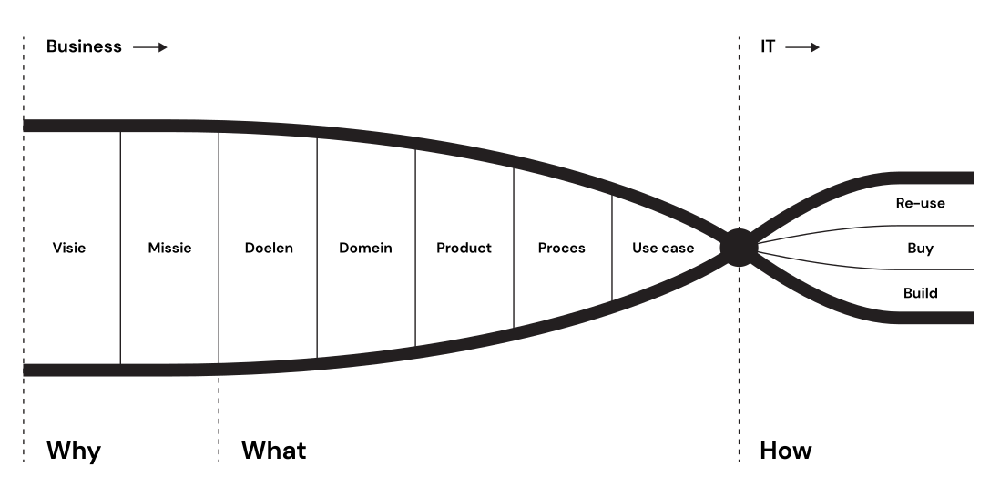

# Waarborgfonds saneringskredieten

## Visie

Uit onderzoek blijkt dat een deel van de gemeenten nog aarzelt over de inzet van saneringskredieten. Een reden hiervoor is tweedelig, aan de ene kant komt dit door onbekendheid en aan de andere kant bestaat er zorg over de mogelijke risico’s van het niet of slechts deels terugbetalen van het saneringskrediet aan de kredietbank. Omdat kredietbanken aan gemeenten vragen borg te staan voor dit risico, komt het risico op saneringskredieten bij gemeenten te liggen.

## Missie

De missie van het Waarborgfonds Saneringskredieten is:

Saneringskredieten aantrekkelijker en toegankelijker maken voor gemeenten om zo de effectiviteit van de hele ketenaanpak rondom problematische schulden te vergroten.

Het Wsk verwezenlijkt deze doelstelling door:

1. Het afgeven van borgstellingen voor saneringskredieten en het uitkeren van de borgstellingen in geval van oninbare kredieten aan deelnemende kredietbanken.
1. Zorgvuldig beheer van de haar toevertrouwde middelen en de eventueel te werven middelen.
1. Het belang van saneringskredieten en de voordelen van het fonds actief onder de aandacht brengen van relevante partijen in het schuldhulpverleningsland.

## Aanpak

## Organisatie

Het werk van het Wsk is belegd bij twee stichtingen:

* Stichting Bemiddeling en Fondsbeheer (SBF)
* Stichting Sociale Banken Nederland (SBN)

De Stichting SBF sluit overeenkomsten met de kredietbanken om garant te staan voor afgesloten Saneringskredieten.

[Context](context.puml)

## Randvoorwaarden

* De meeste kredietbanken maken gebruik van Allegro en een enkele van Stratech, het ontwerp dient hierbij aan te sluiten.
* Voor gegevensuitwisseling gebruik gemaakt van het Schuldenknooppunt. Indien er gegronde redenen zijn hiervan af te wijken, is dat wel mogelijk.
* Het ontwerp moet tot minimale extra werklast aan de kant van de kredietbanken leiden.
* Uitwisseling van gegevens dient in lijn met de AVG-wetgeving te gebeuren.
* Handmatig aanleveren en ontsluiten van kredietbank gegevens moet mogelijk zijn.
* Informatie wordt in context van een kredietbank opgeslagen en beveiligd.
* **Handelingen zijn herleidbaar:** Elke handeling moet herleidbaar zijn naar een persoon of systeem.
* **Vierogenprincipe:** Het vierogenprincipe stelt dat voor bepaalde handelingen altijd 2 mensen nodig zijn. Zodat zij elkaar kunnen controleren. Dit om fraude of andere misstanden te voorkomen.
* **Minimalisatie van operationele werkzaamheden:** Werkzaamheden dienen zoveel mogelijk geautomatiseerd en volgens vaste processen plaats te vinden. Output dient uniform te zijn.
* **Data minimalisatie:** In het ontwerp moet gewaarborgd worden dat er niet méér persoonsgegevens verwerkt worden dan strikt noodzakelijk voor het doel van de verwerking.

## Context

Iemand met problematische schulden kan bij zijn of haar gemeente terecht voor schuldhulpverlening. Gemeenten in Nederland zijn verantwoordelijk voor de uitvoering van de Wet gemeentelijke schuldhulpverlening. De gemeente probeert met burgers in schulden een minnelijke schuldregeling te treffen. Het doel van zo’n regeling is om afspraken te maken met de hulpvrager en met zijn of haar schuldeisers, zodat eerstgenoemde in drie jaar van alle schulden afkomt en met een schone lei kan beginnen.

Daarbij hoort een berekening van de maandelijkse aflossingscapaciteit van degene in de schulden. Die berekening bepaalt hoeveel schuldeisers van hun openstaande vordering terug ontvangen. Een gemeente kan proberen een schuldbemiddelingstraject op te starten, waarbij de persoon met schulden in drie jaar tijd maandelijks aan diverse schuldeisers een gedeelte aflost óf de gemeente kan een saneringskrediet aanbieden.

Een saneringskrediet is een kredietovereenkomst waarbij de totale schuldenlast tegen finale kwijting wordt afgekocht, op basis van het betalen van een percentage van de totale schuldenlast. Hierdoor blijft er na verstrekking van het saneringskrediet één schuldeiser over: een kredietbank. Gemeenten maken afspraken met een kredietbank, waarvan er 23 in Nederland zijn, om de financiële afhandeling van het saneringskrediet te organiseren. Afspraken over de reikwijdte van de inzet van kredietbanken, het gebruikte instrumentarium en de financiële vergoeding kunnen lokaal sterk verschillen.  

Ruim een kwart van de Nederlandse gemeenten benut momenteel de mogelijkheid van de inzet van saneringskredieten. Hiervoor werken zij samen met kredietbanken. In sommige gemeenten is de kredietbank onderdeel van de gemeentelijke organisatie. De belangstelling voor saneringskredieten groeit snel. Het geeft mensen met financiële problemen rust: in plaats van een veelheid aan schuldeisers resteert er slecht één schuldeiser (de kredietbank) en één lening (het saneringskrediet). Het geeft duidelijkheid aan de voorkant van het hulpverleningsproces aan de persoon met financiële problemen én aan schuldeisers. Schuldeisers schrijven een deel van de (oninbare) vordering af en besparen op hun debiteurenbeheer. En gemeenten besparen tijd, omdat schuldhulpverleners geen hercontroles hoeven uit te voeren.

Naar aanleiding van een petitie uit 2019 van de NVVK is [de motie Segers c.s. (TK 35570 nr. 24)](https://zoek.officielebekendmakingen.nl/kst-35570-24.html) aangenomen, die oproept tot oprichting van een Waarborgfonds voor saneringskredieten (hierna: Wsk). Met het Wsk wordt het risico voor gemeenten bij het verstrekken van een saneringskrediet volledig weggenomen, zonder dat het de werkwijze van en samenwerking tussen kredietbanken en gemeenten doorkruist. Het Wsk biedt in feite ‘slechts’ een (aantrekkelijke) extra mogelijkheid om saneringskredieten te borgen.  

Het Wsk is met steun van het Ministerie van Sociale Zaken en Werkgelegenheid opgericht en werkt vanuit twee stichtingen op non-profit basis. Na de opstartperiode zal er toegegroeid worden naar een revolverend fonds.
